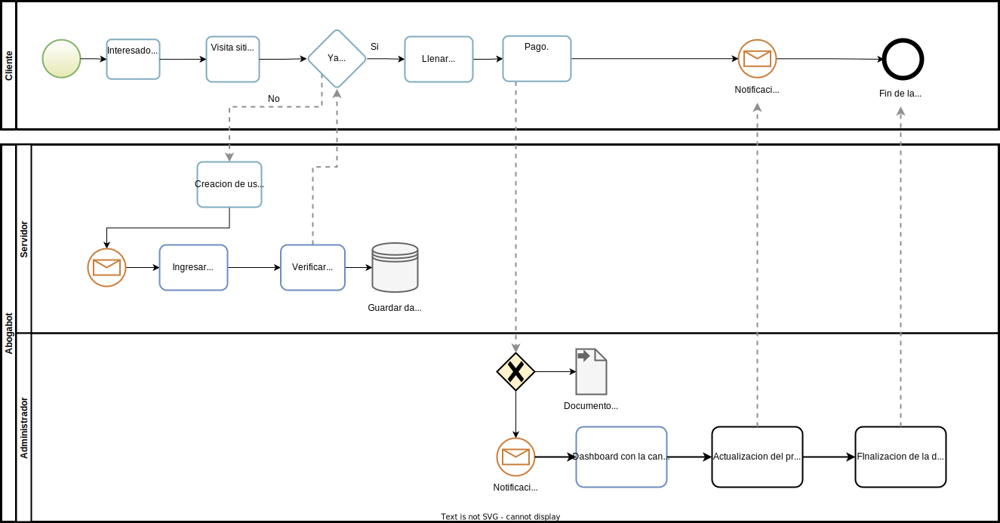
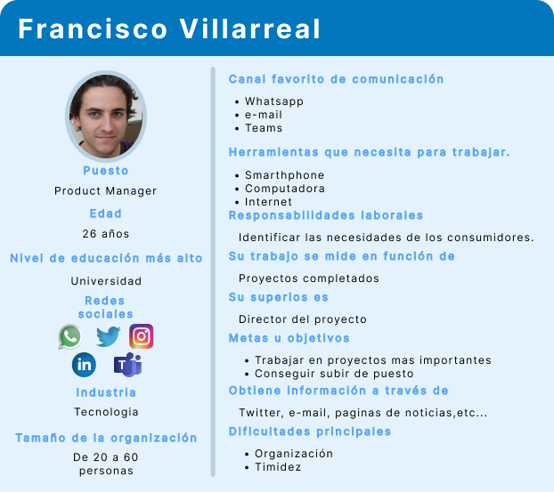
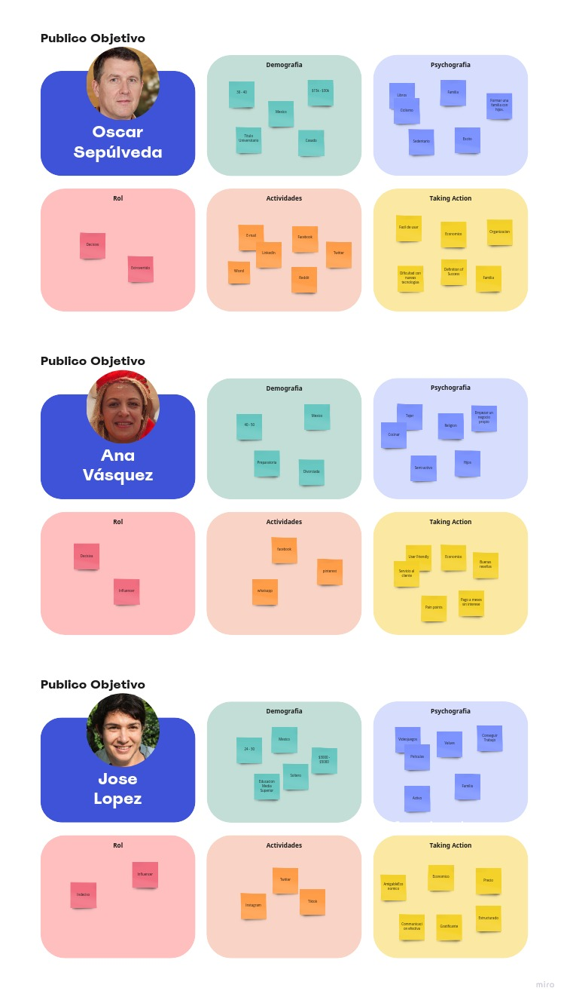
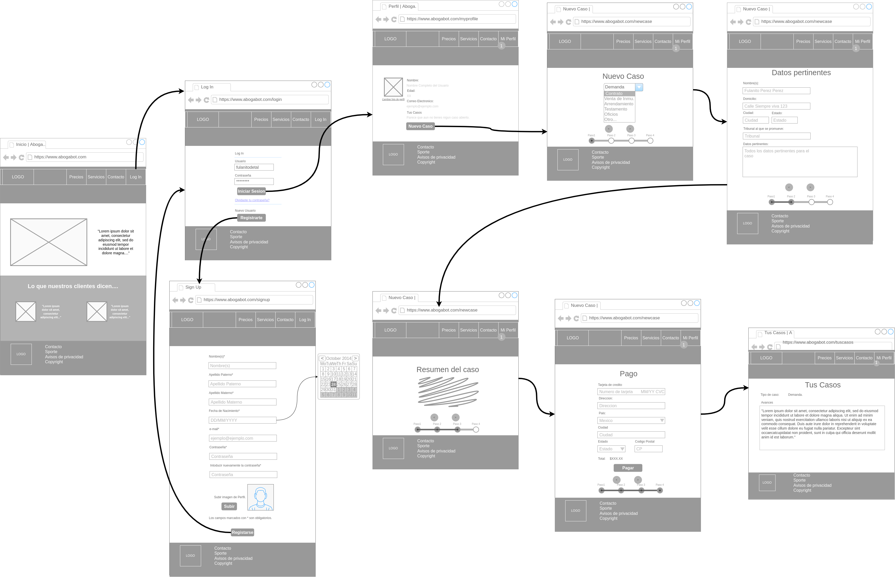
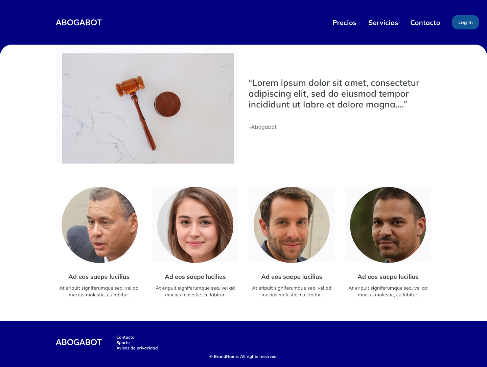
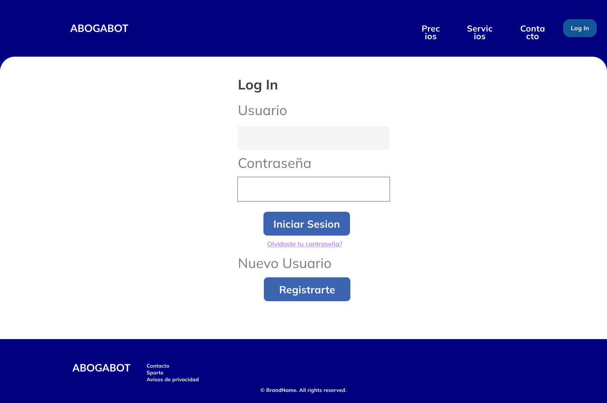

 <b> DESCRIPCION GENERAL DEL REQUERIMIENTO </b> 
 

| PROYECTO                                                                     | Abogabot [^1]|
|---                                                                           |---|
| Nombre Requerimiento:                                                        | Creacion de sitio web. |
| Fecha Solicitud:                                                             | 01/10/2022 |
|  Responsable(s) Solicitante:                                                 | LaunchX |
|Dependencia(s) Solicitante:                                                   | Desarrollo de Software|
|Responsable Funcional designado  por el equipo de desarrollo de software:|Alejandro Reyes Cerecero | 

_______

 <b> FASE DE FORMALIZACION  </b> 
 

| Descripcion de la Solicitud  |
| --- |
| Usuario Solicitante  |
| Crear una pagina web donde los clientes puedan hacer la creacion, modificacion y seguimiento de sus casos, haci como el pago correspondiente de los mismos. Los administradores del sitio deberan ser capaces de recibir el pago por parte de los clientes, actualizar los casos y recibir notificaciones.  |
|  Lider Funcional |
| Creacion de un sitio web en donde los clientes de la firma puedan ser capaces de llenar un formulario cuando estan interesados en realizar un movimiento legal, los usuarios deberan ser capaces de registrarse en el sitio web, tambein debera ser posible para los usuarios recibir notificaciones de cada actualizacion en cuanto a su caso y por ultimo el cliente debera ser capaz de realizar el pago desde la misma pagina web. El sitio web tambien debera de tener opcion para que los administradores reciban notificaciones cuando un caso nuevo a sido registrado, Los administradores tambien deberan poder recibir el pago por parte del cliente y poder actualizar cada caso.   | 

___

 <b> ANALISIS DE REQUISITOS Y REQUERIMIENTOS </b> 
 

| Modelamiento de Negocio [^2] |
|---|
|  |

___

 <b> TERMINOS DE REFERENCIA </b> 
 

|   | Terminos de Referencia  | 
|---|---|
|Alcance de la solucion | * Pagina Web   * Creacion de usuarios   * Los usuarios podran crear y observar el progreso de sus casos.   * Creacion automatica del documento legal apartir del formulario creado por el usuario.   * Pagos desde la Web.    * Correos de actualizacion y notificaciones al usuario. Y de nuevos casos a los administradores.   * Sitio web responsibo para celular.   FUERA DEL ALCANCE:   * Pagos en efectivo.    * Capacitacion de los administradores. | 
|Requerimientos Funcionales y   criterios de aceptacion. |Requisito: Los tramites de los pagos ocurren sin fallos.   Criterio de aceptacion: La transferencia monetaria ocurre sin problemas y fue aceptada al 100%.   Requisito:El sitio web se debe adaptar a diferentes dispositivos.   Criterio de aceptacion: El sitio web se adapta a la mayoria de displays.   Requisito: El sitio web debe generar el documento legal automaticamente.   Criterio de aceptacion: El documento debe ser generado en el 100% de los casos.   Requisito: El usuario debe ser notiificado en cada avance de su caso.   Criterio de aceptacion: El usuario es notificado en las actualizaciones mas importantes.|
|Requerimientos no Funcionales  | * El sitio web debe poder ser accesible el 99,9% de las veces en que un usuario intente accederlo.   * El formulario, los datos personales de los usuario y contraseñas deberan ser encriptadas.   * El sitio web debera poder ser usado en los navegadores mas usados tanto PC como dispositivos mobiles.  |

___

 <b> BUYER PERSONA </b> 
 

| Buyer Persona [^3] |
|---|
|  [^fakepeople]|

___

 <b> PUBLICO OBJETIVO </b> 
 

| Publico Objetivo [^5] |
|---|
|  [^fakepeople] |

___

 <b> WIREFRAME UX</b> 
 

| Wireframe UX [^6] |
|---|
|  |
| [Full Image here](https://github.com/Cere-0/Abogabot/blob/main/images/WireframeUX.drawio.png) |

___

 <b> WIREFRAME UI</b> 
 

| Wireframe UI [^7] |
|---|
|  |
| |
| |

___

### Footnotes
[^1]: [Practica para LaunchX](https://github.com/Launch-X-Latam/MisionFrontEnd/blob/main/01%20-%20INTRO/practicas/README.md)
[^2]: Diagram made with [draw.io](https://app.diagrams.net/)
[^3]: Buyer persona made with [Figma](https://www.figma.com/)
[^fakepeople]: The profile pictures used in this project are from [This Person Does Not Exist](https://thispersondoesnotexist.com/)
[^5]: Image made with [miro.com](https://miro.com/)
[^6]: Wireframe made with [draw.io](https://app.diagrams.net/)
[^7]: UI made with [Figma](https://www.figma.com/)
